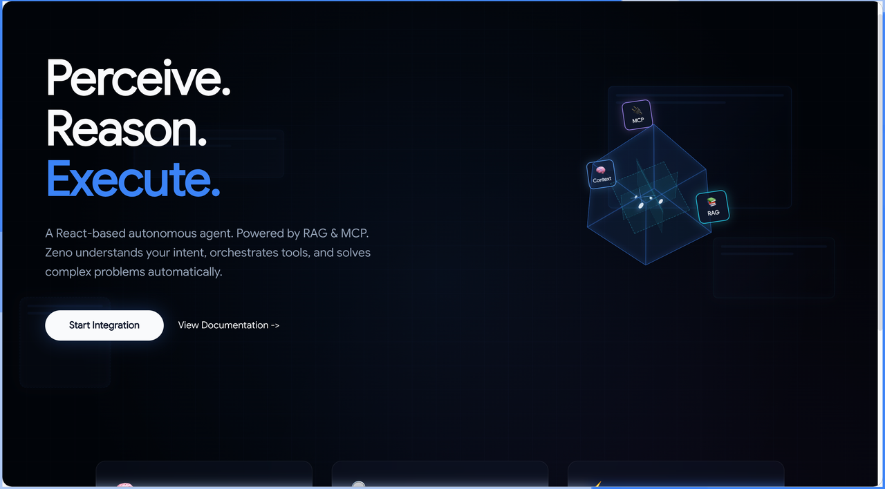
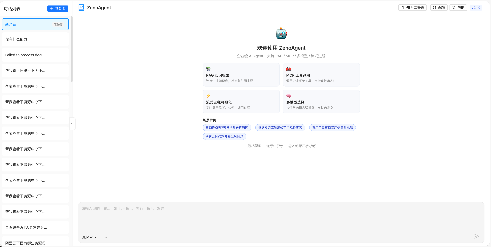
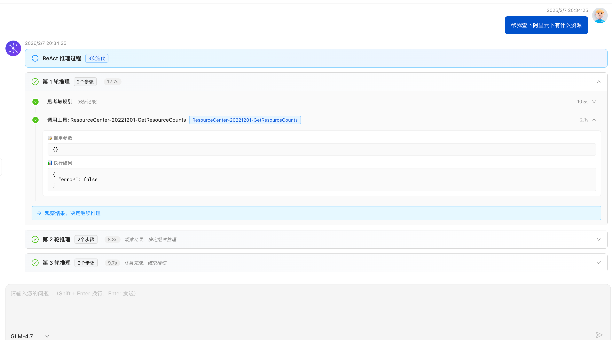
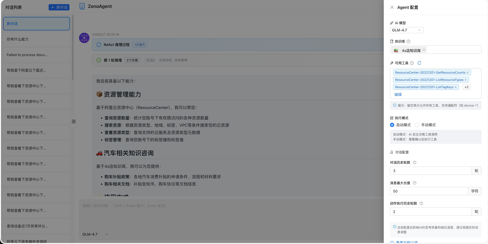
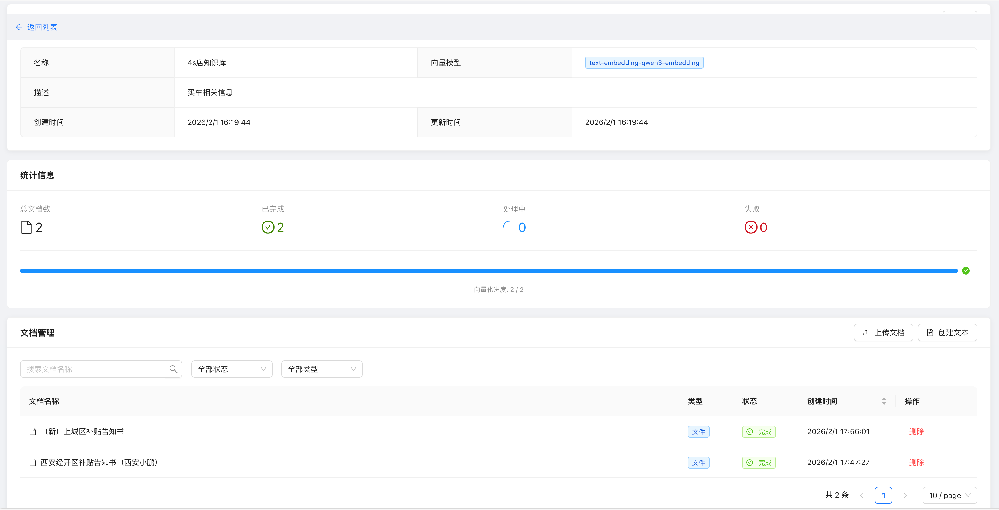

# Zeno Agent

<div align="center">


**一个轻量化的 AI Agent 平台，支持 RAG、MCP 工具调用、ReAct 推理等核心能力**

[功能特性](#-核心特性) • [快速开始](#-快速开始) • [文档](#-文档) • [部署指南](./DEPLOYMENT.md) • [贡献指南](./CONTRIBUTING.md)

</div>

---

## 📖 项目简介

Zeno Agent 是一个基于 Spring Boot 和 Vue 3 构建的 AI Agent 平台，集成了 LangChain4j 框架，提供智能对话、知识检索增强（RAG）、工具调用（MCP）等核心能力。项目采用前后端分离架构，支持流式响应、多会话管理、知识库管理等完整功能。

项目已经部署上线，[线上体验地址](http://1.94.53.50/)
（模型大小决定Agent是否聪明，线上本地部署了qwen3:8b 开源大模型供大家体验支持）

## ✨ 核心特性

### 🤖 智能 Agent 能力
- **ReAct 推理引擎**: 基于 ReAct（Reasoning + Acting）模式，支持思考-行动-观察循环
- **任务自动分类**: 自动识别简单对话、知识查询、工具调用等任务类型
- **动态模型选择**: 根据配置自动选择最优 LLM 模型
- **流式实时反馈**: SSE 流式推送 AI 思考过程和执行进度
- **全面国际化 (i18n)**: 支持中英双语无缝切换，状态提示可本地化配置

### 📚 RAG 知识检索
- **向量数据库支持**: 基于 PostgreSQL + pgvector 的向量存储
- **多知识库管理**: 支持创建多个知识库，灵活组织文档
- **文档解析**: 支持 PDF、Word、TXT、Markdown 等多种格式
- **智能分段**: 自动文档分段和向量化，支持相似度检索

### 🔧 MCP 工具调用
- **MCP 协议支持**: 基于 Model Context Protocol 的工具调用框架
- **工具自动发现**: 自动发现和注册 MCP 服务器提供的工具
- **工具分组管理**: 支持工具分组，灵活启用/禁用工具组
- **手动确认模式**: 支持工具执行前的人工确认（安全模式）

### 💾 数据存储
- **Redis**: 用于会话上下文、短期记忆缓存
- **MySQL**: 用于会话、消息、知识库、文档等持久化存储
- **PostgreSQL**: 用于向量存储（RAG 功能）

### 🎨 前端特性
- **现代化 UI**: 基于 Ant Design Vue 的美观界面
- **实时状态展示**: 可视化展示 Agent 思考过程、工具调用、RAG 检索等
- **多会话管理**: 支持多个对话会话，独立上下文管理
- **Markdown 渲染**: 支持 Markdown 格式的消息渲染，代码高亮

详细的技术架构说明请参考 [技术架构文档](./TECHNICAL_ARCHITECTURE.md)。

## 📋 技术栈

### 后端
- **Java 17** - 编程语言
- **Spring Boot 2.7.18** - 应用框架
- **LangChain4j 1.9.1** - LLM 抽象层和工具集成
- **Spring Data Redis** - Redis 数据访问
- **MyBatis** - ORM 框架
- **PostgreSQL + pgvector** - 向量数据库（RAG）
- **MySQL** - 关系数据库（持久化）
- **Redisson** - 分布式锁和队列

### 前端
- **Vue 3.3+** - 前端框架
- **TypeScript 5.0+** - 类型系统
- **Vite 5.0+** - 构建工具
- **Ant Design Vue 4.0+** - UI 组件库
- **Axios** - HTTP 客户端
- **Markdown-it** - Markdown 渲染
- **Lottie** - 动画支持

## 🚀 快速开始

详细部署说明请参考 [部署指南](./DEPLOYMENT.md)。

### 前置要求

1. **Java 17+**
2. **Maven 3.6+**
3. **Node.js 20+** 和 **pnpm 9+**
4. **Redis 6.0+** (必需)
5. **MySQL 8.0+** (必需，用于持久化)
6. **PostgreSQL 14+** (可选，RAG 功能需要，需安装 pgvector 扩展)

### 使用 Docker Compose 快速启动（推荐）

```bash
# 1. 复制环境变量配置
cp env.example .env
# 编辑 .env 文件，至少设置 OPENAI_API_KEY 或 DEEPSEEK_API_KEY（详见 [配置变量参考](./docs/CONFIG_REFERENCE.md)）

# 2. 启动所有服务
./scripts/docker-start.sh
# 或使用 docker-compose
docker-compose up -d

# 3. 查看服务状态
docker-compose ps

# 4. 查看日志
docker-compose logs -f

# 5. 停止服务
docker-compose down
```

访问地址：
- 前端: http://localhost:5173
- 后端 API: http://localhost:8080
- Swagger 文档: http://localhost:8080/swagger-ui.html

## 📖 文档

- [配置变量参考](./docs/CONFIG_REFERENCE.md) - 所有配置项一览
- [部署指南](./DEPLOYMENT.md) - 生产环境部署说明
- [贡献指南](./CONTRIBUTING.md) - 如何参与项目贡献
- [技术架构](./TECHNICAL_ARCHITECTURE.md) - 详细的技术架构设计
- [API 文档](./docs/API.md) - API 接口文档
- [前端 Agent 组件文档](./frontend/src/views/agent/README.md) - 前端组件使用说明

## 🏗️ 项目结构

```
ZenoAgent/
├── backend/                      # 后端项目
│   ├── src/main/java/com/aiagent/
│   │   ├── api/                  # API 层
│   │   │   ├── controller/       # REST 控制器
│   │   │   └── dto/              # 数据传输对象
│   │   ├── application/          # 应用服务层
│   │   │   ├── service/          # 业务服务
│   │   │   │   ├── agent/        # Agent 服务
│   │   │   │   ├── engine/       # 推理引擎（ReAct）
│   │   │   │   ├── rag/          # RAG 服务
│   │   │   │   ├── action/       # 动作执行
│   │   │   │   └── memory/       # 记忆管理
│   │   │   └── model/            # 领域模型
│   │   ├── domain/               # 领域层
│   │   │   ├── entity/           # 实体类
│   │   │   └── enums/            # 枚举类
│   │   ├── infrastructure/       # 基础设施层
│   │   │   ├── config/           # 配置类
│   │   │   ├── external/         # 外部服务集成
│   │   │   │   ├── llm/          # LLM 集成
│   │   │   │   └── mcp/          # MCP 工具集成
│   │   │   ├── mapper/           # MyBatis Mapper
│   │   │   └── repository/      # 数据访问
│   │   └── shared/               # 共享组件
│   │       ├── response/         # 统一响应
│   │       ├── exception/        # 异常处理
│   │       └── util/             # 工具类
│   └── src/main/resources/
│       ├── application.yml       # 主配置
│       ├── profile/              # 环境配置
│       ├── mapper/               # MyBatis XML
│       └── sql/                  # SQL 脚本
│
├── frontend/                     # 前端项目
│   ├── src/
│   │   ├── views/agent/          # Agent 聊天界面
│   │   │   ├── AgentChat.vue     # 主组件
│   │   │   ├── components/       # 子组件
│   │   │   ├── hooks/            # Vue Hooks
│   │   │   └── agent.api.ts      # API 封装
│   │   ├── views/knowledge-base/ # 知识库管理
│   │   ├── api/                  # API 定义
│   │   ├── utils/                # 工具函数
│   │   └── types/                # TypeScript 类型
│   └── public/                   # 静态资源
│
├── docs/                         # 文档
├── scripts/                      # 脚本
└── docker-compose.yml            # Docker 编排
```

## 🔧 核心功能说明

### 1. ReAct 推理引擎

项目实现了完整的 ReAct（Reasoning + Acting）推理引擎，支持：

- **思考阶段**: AI 分析任务，生成思考过程和行动计划
- **行动阶段**: 执行工具调用、RAG 检索等动作
- **观察阶段**: 观察执行结果，决定下一步行动
- **迭代循环**: 支持多轮迭代，直到任务完成或达到最大迭代次数

### 2. RAG 知识检索

- **文档上传**: 支持多种格式文档上传（PDF、Word、TXT 等）
- **向量化**: 使用 Embedding 模型将文档转换为向量
- **相似度检索**: 根据用户问题检索相关文档片段
- **上下文增强**: 将检索到的知识注入到 LLM 提示词中

### 3. MCP 工具调用

- **工具发现**: 自动发现 MCP 服务器提供的工具
- **工具分组**: 支持工具分组管理，可按组启用/禁用
- **执行模式**: 支持自动执行和手动确认两种模式
- **结果处理**: 自动解析工具执行结果，传递给 LLM

### 4. 会话管理

- **多会话支持**: 支持创建多个独立对话会话
- **上下文记忆**: 自动维护对话上下文，支持多轮对话
- **会话持久化**: 会话和消息持久化到 MySQL
- **记忆管理**: Redis 缓存短期记忆，提高响应速度

## ⚙️ 配置说明

### 最小配置

只需配置数据库连接和 LLM API Key：

```yaml
spring:
  redis:
    host: localhost
    port: 6379
  datasource:
    url: jdbc:mysql://localhost:3306/zeno_agent
    username: root
    password: your_password

aiagent:
  llm:
    models:
      - id: gpt-4o-mini
        provider: OPENAI
        apiKey: ${OPENAI_API_KEY}
    default-model: gpt-4o-mini
```

### 环境变量

```bash
# LLM API Keys
OPENAI_API_KEY=sk-xxx
DEEPSEEK_API_KEY=sk-xxx

# 数据库
MYSQL_HOST=localhost
MYSQL_PORT=3306
MYSQL_USER=root
MYSQL_PASSWORD=your_password

# Redis
REDIS_HOST=localhost
REDIS_PORT=6379
```

## 🎯 使用示例

### 1. 简单对话

直接与 AI 进行对话，无需任何配置：

```
用户: 你好，介绍一下你自己
AI: 你好！我是 Zeno Agent，一个智能 AI 助手...
```

### 2. 知识库查询

创建知识库并上传文档后，AI 可以从知识库中检索相关信息：

```
用户: 什么是 Spring Boot？
AI: [从知识库检索相关文档] Spring Boot 是...
```

### 3. 工具调用

配置 MCP 工具后，AI 可以调用工具完成任务：

```
用户: 查询当前系统时间
AI: [调用系统工具] 当前时间是 2024-01-01 12:00:00
```

### 4. 复杂任务

AI 可以自动规划并执行多步骤任务：

```
用户: 帮我分析这个文档并生成摘要
AI: [思考] -> [上传文档] -> [解析文档] -> [生成摘要]
```

## 📸 项目截图

### 欢迎页


### 智能对话




### Agent 配置


### 知识库管理

## 📝 开发计划

- [x] 基础框架搭建
- [x] ReAct 推理引擎
- [x] RAG 知识检索
- [x] MCP 工具调用
- [x] 前端界面开发
- [x] 会话管理
- [x] 动作支持并行
- [ ] Plan-and-Execute（规划 - 执行）
- [ ] 更多 LLM 提供商支持
- [ ] 工具市场
- [ ] 插件系统

## 📄 许可证

本项目采用 [MIT License](./LICENSE) 开源协议。

## 🤝 贡献

我们欢迎所有形式的贡献！请查看 [贡献指南](./CONTRIBUTING.md) 了解详细信息。

- 🐛 [报告 Bug](https://github.com/your-org/ZenoAgent/issues)
- 💡 [提出功能建议](https://github.com/your-org/ZenoAgent/issues)
- 📝 [提交 Pull Request](https://github.com/your-org/ZenoAgent/pulls)

## ⭐ Star History

如果这个项目对您有帮助，请给我们一个 Star ⭐

## 📞 联系我们

- 提交 Issue: [GitHub Issues](https://github.com/your-org/ZenoAgent/issues)
- 讨论: [GitHub Discussions](https://github.com/your-org/ZenoAgent/discussions)

## 🙏 致谢

感谢所有为这个项目做出贡献的开发者！

---

<div align="center">
Made with ❤️ by JohnnyJin
</div>
