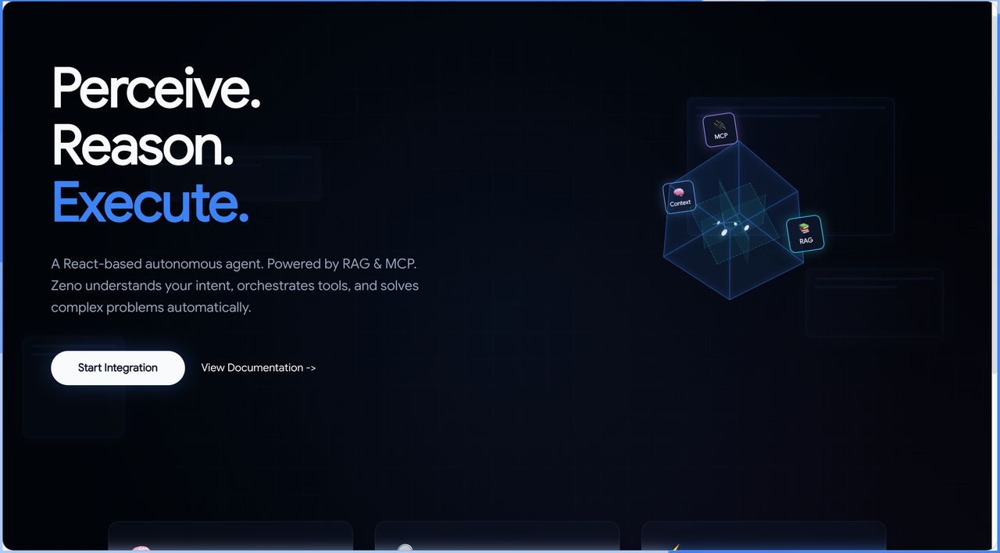
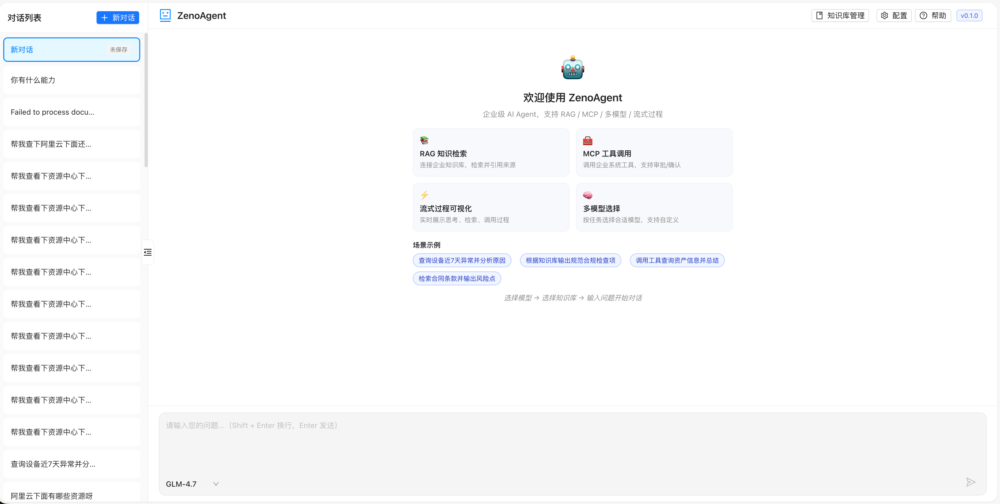
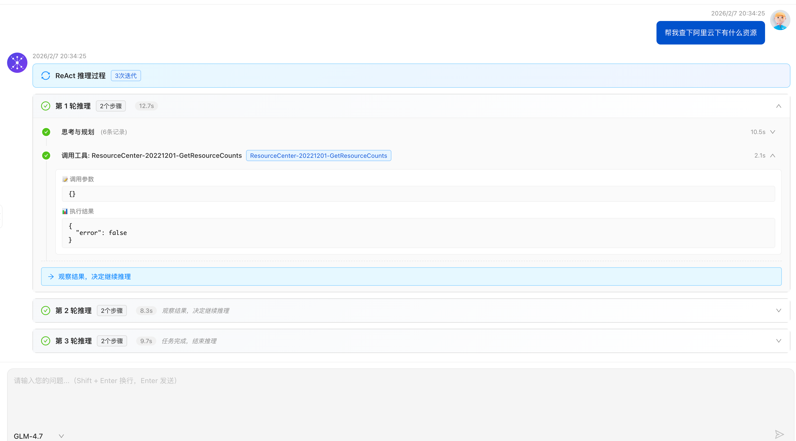
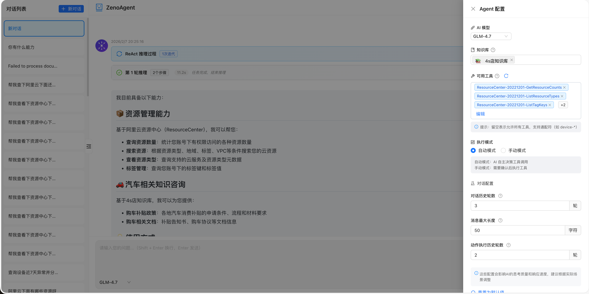
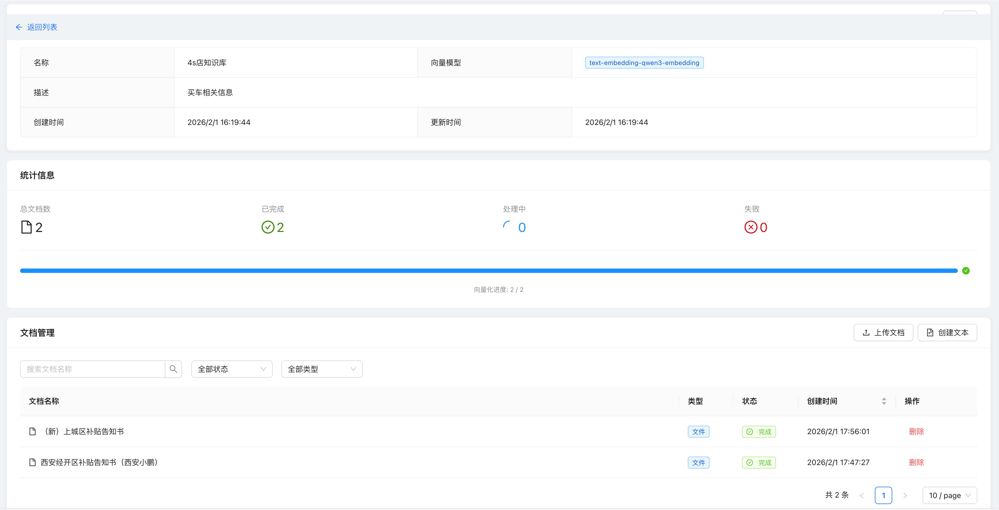

# Zeno Agent

<div align="center">


**服务端 toB AI Agent 平台 —— 支持自定义 Agent、GLOBAL/PERSONAL 双模式 MCP、Skill 机制、工具渐进式加载等企业级能力**

[功能特性](#-核心特性) • [快速开始](#-快速开始) • [文档](#-文档) • [部署指南](./DEPLOYMENT.md) • [贡献指南](./CONTRIBUTING.md)

</div>

---

## 📖 项目简介

Zeno Agent 是一个面向企业（toB）的服务端 AI Agent 平台，基于 Spring Boot + LangChain4j 1.11.0 构建。平台的核心能力在于：每个 Agent 可以独立配置自己的工具集、知识库和 Skill 库；通过 GLOBAL/PERSONAL 双模式 MCP 架构，既支持企业统一管控的服务端工具，也支持用户私有的客户端工具（密钥不离开浏览器）；配合工具渐进式加载和 Skill 渐进式注入，突破 LLM 上下文窗口限制，让 Agent 可以绑定数十乃至上百个工具。

项目已经部署上线，[线上体验地址](http://1.94.53.50/)
（线上部署了 qwen3:8b 开源大模型供体验）

## ✨ 核心特性

### 🤖 自定义 Agent 管理
- **多维度配置**: 每个 Agent 独立配置系统提示词、工具集（GLOBAL MCP / PERSONAL MCP / 系统工具）、知识库、Skill 目录树
- **三层优先级覆盖**: 前端请求参数 → Agent 持久化配置 → 硬编码默认值，灵活支持运行时动态调整
- **执行模式切换**: AUTO 模式（AI 自主决策）和 MANUAL 模式（关键操作人工确认）可按 Agent 粒度配置
- **上下文行为控制**: 可配置历史消息加载上限（默认 20 条）和最大工具调用轮数（默认 8 轮）

### 🔌 GLOBAL / PERSONAL 双模式 MCP

这是项目的核心架构创新，将 MCP 服务器区分为两种作用域：

| 特性 | GLOBAL（scope=0） | PERSONAL（scope=1） |
|------|-------------------|---------------------|
| **执行位置** | 服务端 | 客户端（浏览器） |
| **密钥存储** | 数据库（加密） | 浏览器 localStorage |
| **用户可见** | 所有 Agent 共享 | 用户隔离 |
| **工具加载** | 服务端预初始化 | 前端 prefetch 后上传 schema |
| **适用场景** | 企业统一工具（数据库、内网系统等） | 用户私有工具（GitHub、Notion 等） |

支持的 MCP 连接协议：`streamable-http`（远端推荐）、`stdio`（本地进程）、`websocket`、`sse`

### 🧠 Skill 机制（渐进式知识注入）
- **两层内容设计**: 每条 Skill 包含「摘要」和「全文」，System Prompt 只注入摘要，不消耗 Token 配额
- **按需加载全文**: LLM 判断需要使用某 Skill 时，调用 `system_load_skill` 工具动态获取完整内容
- **树形目录结构**: Skill 以目录树形式绑定到 Agent，支持父子联动勾选、灵活分组管理
- **企业知识资产**: 沉淀业务知识为 Skill 库，按需挂载到不同 Agent，实现知识复用

### ⚡ 工具渐进式加载（Progressive Tool Loading）
- **自动触发**: 绑定工具数量超过阈值时系统自动进入渐进式模式
- **按需解析**: System Prompt 只注入工具名和简介，LLM 调用 `system_resolve_tools` 后才加载完整 Schema
- **动态扩展**: 每轮推理后动态追加新工具定义，下一轮即可使用
- **突破限制**: 彻底解决 LLM 上下文窗口对工具数量的限制

### 🛡️ Human-in-the-loop（分布式人工确认）
- **MANUAL 模式**: 工具执行前通过 SSE 通知前端等待用户确认
- **分布式实现**: 基于 Redisson `RBlockingQueue` 实现跨实例的异步确认，天然支持多节点部署
- **超时保护**: 可配置确认超时时间，超时自动返回 TIMEOUT 决策让 LLM 重新规划
- **PERSONAL MCP 回传**: 客户端工具执行结果通过 `ClientToolCallManager` CompletableFuture 机制回传

### 📚 RAG 知识检索
- **向量数据库**: 基于 PostgreSQL + pgvector 的高维向量存储
- **多知识库管理**: 支持创建多个知识库，按 Agent 独立绑定
- **多格式文档**: 支持 PDF、Word、TXT、Markdown 等格式（Apache Tika 解析）
- **预检索增强**: Agent 执行前可进行 RAG 预检索，将结果注入初始上下文

### 🌊 全链路 SSE 流式实时反馈
- **可观测推理过程**: 实时推送思考、工具调用、RAG 检索、PERSONAL 工具下发等全部中间状态
- **异步 + 流式**: Agent 任务在独立线程异步执行，LLM 生成内容增量推送
- **完整事件体系**: 包含 `agent:start`、`agent:thinking`、`agent:rag_retrieve`、`agent:tool_call`、`agent:personal_tool_call`、`agent:message`、`agent:complete`、`agent:error` 等完整事件

### 💾 数据存储
- **Redis**: 会话上下文、短期记忆缓存、分布式锁与队列（Redisson）
- **MySQL**: 会话、消息、知识库、文档、Agent 定义、MCP 服务器配置等持久化
- **PostgreSQL**: 向量存储（RAG 功能）

### 🎨 前端特性
- **现代化 UI**: 基于 Ant Design Vue 的美观界面，支持中英双语（i18n）
- **实时状态展示**: 可视化展示 Agent 思考过程、工具调用、PERSONAL MCP 下发、RAG 检索等
- **多会话管理**: 支持多个独立对话会话，上下文隔离
- **Markdown 渲染**: 支持 Markdown 格式消息渲染，代码语法高亮

详细技术架构说明请参考 [技术架构文档](./TECHNICAL_ARCHITECTURE.md)。

## 📋 技术栈

### 后端
- **Java 17** - 编程语言
- **Spring Boot 2.7.18** - 应用框架
- **LangChain4j 1.11.0** - LLM 抽象层和 MCP 工具集成
- **Spring Data Redis** - Redis 数据访问
- **Redisson 3.23.5** - 分布式锁和阻塞队列
- **MyBatis** - ORM 框架
- **Druid** - 数据库连接池
- **PostgreSQL + pgvector** - 向量数据库（RAG）
- **MySQL 8.0+** - 关系数据库（持久化）
- **Apache Tika 2.9.1** - 文档解析
- **Playwright 1.44.0** - 无头浏览器搜索

### 前端
- **Vue 3.3+** - 前端框架
- **TypeScript 5.0+** - 类型系统
- **Vite 5.0+** - 构建工具
- **Ant Design Vue 4.0+** - UI 组件库
- **Axios** - HTTP 客户端
- **Markdown-it** - Markdown 渲染
- **Lottie** - 动画支持

## 🚀 快速开始

详细部署说明请参考 [部署指南](./DEPLOYMENT.md)。

### 前置要求

1. **Java 17+**
2. **Maven 3.6+**
3. **Node.js 20+** 和 **pnpm 9+**
4. **Redis 6.0+** (必需)
5. **MySQL 8.0+** (必需，用于持久化)
6. **PostgreSQL 14+** (可选，RAG 功能需要，需安装 pgvector 扩展)

### 使用 Docker Compose 快速启动（推荐）

```bash
# 1. 复制环境变量配置
cp env.example .env
# 编辑 .env 文件，至少设置 OPENAI_API_KEY 或 DEEPSEEK_API_KEY（详见 配置变量参考）

# 2. 启动所有服务
./scripts/docker-start.sh
# 或使用 docker-compose
docker-compose up -d

# 3. 查看服务状态
docker-compose ps

# 4. 查看日志
docker-compose logs -f

# 5. 停止服务
docker-compose down
```

访问地址：
- 前端: http://localhost:5173
- 后端 API: http://localhost:8080
- Swagger 文档: http://localhost:8080/swagger-ui.html

## 📖 文档

- [配置变量参考](./docs/CONFIG_REFERENCE.md) - 所有配置项一览
- [部署指南](./DEPLOYMENT.md) - 生产环境部署说明
- [后端服务配置](./BACKEND_CONFIG.md) - Redis / MySQL / PostgreSQL 配置
- [贡献指南](./CONTRIBUTING.md) - 如何参与项目贡献
- [技术架构](./TECHNICAL_ARCHITECTURE.md) - 详细技术架构设计
- [API 文档](./docs/API.md) - API 接口文档

## 🏗️ 项目结构

```
ZenoAgent/
├── backend/                      # 后端项目（Spring Boot）
│   └── src/main/java/com/aiagent/
│       ├── api/                  # API 层
│       │   ├── controller/       # REST 控制器（10 个）
│       │   └── dto/              # 数据传输对象
│       ├── application/          # 应用服务层
│       │   ├── AgentServiceImpl  # Agent 执行入口（SSE 流式）
│       │   ├── FunctionCallingEngine  # Function Calling 推理引擎
│       │   └── service/          # 业务服务（RAG / Memory / Skill 等）
│       ├── domain/               # 领域层（DDD）
│       │   ├── agent/            # Agent 定义（AgentDefinition）
│       │   ├── skill/            # Skill 领域对象与树形结构
│       │   ├── tool/             # 工具注册表 / 系统工具（渐进式加载）
│       │   ├── mcp/              # MCP 服务器领域服务
│       │   ├── rag/              # RAG 检索
│       │   ├── memory/           # 记忆管理
│       │   └── model/            # 领域模型（BO / Entity）
│       └── infrastructure/       # 基础设施层
│           ├── config/           # 配置类
│           ├── external/mcp/     # MCP 客户端工厂 / 传输协议 / 确认管理
│           ├── mapper/           # MyBatis Mapper
│           ├── repository/       # 数据访问
│           └── search/           # Playwright 浏览器搜索
│
├── frontend/                     # 前端项目（Vue 3 + TypeScript）
│   └── src/
│       ├── views/agent/          # Agent 聊天界面（SSE 接收 / 工具确认 / PERSONAL MCP）
│       ├── views/knowledge-base/ # 知识库管理
│       ├── api/                  # API 封装
│       ├── utils/                # 工具函数
│       └── types/                # TypeScript 类型定义
│
├── docs/                         # 文档目录
├── scripts/                      # 启动 / 构建脚本
└── docker-compose.yml            # Docker 服务编排
```

## 🔧 核心功能说明

### 1. 自定义 Agent

每个 Agent 是独立的业务实体，可通过管理界面配置以下维度：

- **系统提示词**: 定义 Agent 角色和行为边界
- **GLOBAL MCP 服务器**: 绑定企业统一管控的服务端工具
- **PERSONAL MCP 能力**: 绑定用户私有工具（按能力标签匹配，如 `github`、`notion`）
- **系统内置工具**: 启用 `system_load_skill`、`system_resolve_tools` 等内置能力
- **知识库**: 绑定一个或多个知识库用于 RAG 检索
- **Skill 目录树**: 挂载业务 Skill，构建 Agent 的专属知识体系

### 2. GLOBAL / PERSONAL MCP 双模式

**GLOBAL MCP** 由平台管理员统一配置，工具运行在服务器端：
- 密钥存于数据库（加密），对用户不可见
- 支持 `streamable-http` 远端服务或 `stdio` 本地进程
- 工具发现在服务启动时懒加载，支持热重载

**PERSONAL MCP** 由用户自行接入，工具运行在浏览器中：
- 密钥只存浏览器 localStorage，满足数据合规要求
- 前端在发送消息前 prefetch 工具 Schema 并随请求上传
- LLM 决策后通过 SSE 下发 `PERSONAL_TOOL_CALL` 事件，浏览器执行后回传结果

### 3. Skill 机制

```
System Prompt 注入（轻量）
  - [skill-001] 数据库查询规范: 查询时必须使用参数化 SQL，禁止拼接...
  - [skill-002] 错误处理模板: 遇到业务异常时按以下格式输出...

LLM 按需加载（全文）
  LLM → 调用 system_load_skill("skill-001")
  系统 → 返回完整操作规范（数百至数千字）
  LLM → 按照完整规范执行任务
```

### 4. 工具渐进式加载

```
初始状态（工具数 > 阈值时）
  System Prompt: "可用工具: list_files(列出目录文件), read_file(读取文件内容)..."
  工具列表: [system_resolve_tools]

LLM 调用 system_resolve_tools(["list_files", "read_file"])
  → 系统将完整 ToolSpecification 追加到当前推理循环的 toolSpecs
  → 下一轮 LLM 即可直接调用 list_files / read_file
```

### 5. MANUAL 模式（Human-in-the-loop）

工具执行前通过 SSE 推送确认事件到前端，后端线程阻塞在 Redis 阻塞队列上等待用户点击「批准」或「拒绝」。多实例部署下任意节点都能接收回调并唤醒等待线程。

### 6. ReAct 推理引擎

基于 Function Calling 的标准推理循环，支持：
- 多轮工具调用迭代（最大轮数可配）
- 流式 Token 输出（边生成边推送）
- 工具执行结果自动追加到对话历史
- 支持 GLOBAL 工具（服务端执行）和 PERSONAL 工具（客户端执行）混合调用

## ⚙️ 配置说明

### 最小配置

```yaml
spring:
  redis:
    host: localhost
    port: 6379
  datasource:
    url: jdbc:mysql://localhost:3306/zeno_agent
    username: root
    password: your_password

aiagent:
  llm:
    models:
      - id: gpt-4o-mini
        provider: OPENAI
        apiKey: ${OPENAI_API_KEY}
    default-model: gpt-4o-mini
```

### 环境变量

```bash
# LLM API Keys
OPENAI_API_KEY=sk-xxx
DEEPSEEK_API_KEY=sk-xxx

# 数据库
MYSQL_HOST=localhost
MYSQL_PORT=3306
MYSQL_USER=root
MYSQL_PASSWORD=your_password

# Redis
REDIS_HOST=localhost
REDIS_PORT=6379
```

## 📸 项目截图

### 欢迎页


### 智能对话




### Agent 配置


### 知识库管理


## 📝 开发计划

- [x] 基础框架搭建
- [x] Function Calling 推理引擎
- [x] RAG 知识检索（PostgreSQL + pgvector）
- [x] GLOBAL MCP 工具调用（服务端执行）
- [x] PERSONAL MCP 工具调用（客户端执行）
- [x] 自定义 Agent 管理
- [x] Skill 机制（渐进式知识注入）
- [x] 工具渐进式加载（Progressive Tool Loading）
- [x] MANUAL 模式（Human-in-the-loop）
- [x] 分布式工具确认（Redis 阻塞队列）
- [x] 会话管理与多会话支持
- [x] 动作并行支持
- [x] 流式 SSE 全链路实时反馈
- [ ] Plan-and-Execute（规划 - 执行）
- [ ] 更多 LLM 提供商支持
- [ ] Agent 市场 / 模板
- [ ] 多租户隔离

## 📄 许可证

本项目采用 [MIT License](./LICENSE) 开源协议。

## 🤝 贡献

我们欢迎所有形式的贡献！请查看 [贡献指南](./CONTRIBUTING.md) 了解详细信息。

- 🐛 [报告 Bug](https://github.com/your-org/ZenoAgent/issues)
- 💡 [提出功能建议](https://github.com/your-org/ZenoAgent/issues)
- 📝 [提交 Pull Request](https://github.com/your-org/ZenoAgent/pulls)

## ⭐ Star History

如果这个项目对您有帮助，请给我们一个 Star ⭐

## 📞 联系我们

- 提交 Issue: [GitHub Issues](https://github.com/your-org/ZenoAgent/issues)
- 讨论: [GitHub Discussions](https://github.com/your-org/ZenoAgent/discussions)

## 🙏 致谢

感谢所有为这个项目做出贡献的开发者！

---

<div align="center">
Made with ❤️ by JohnnyJin
</div>
