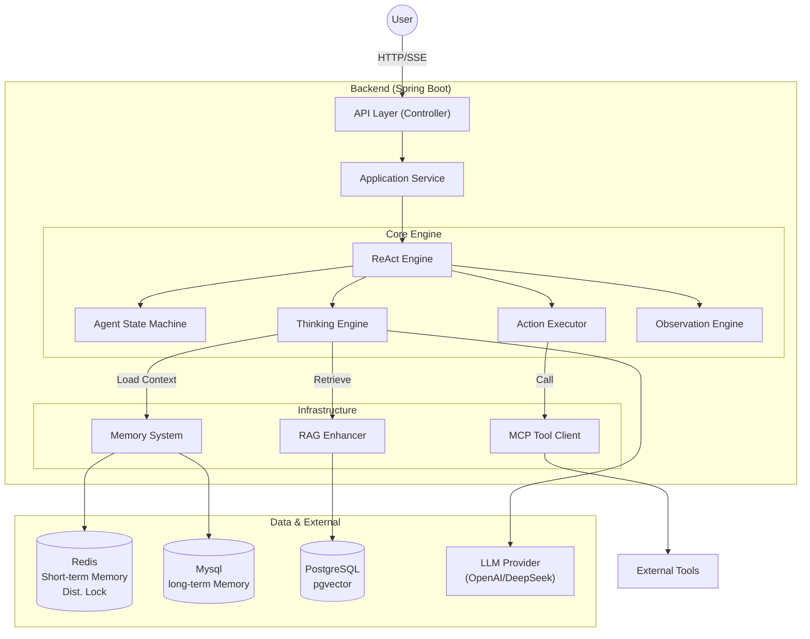
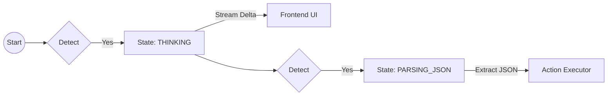
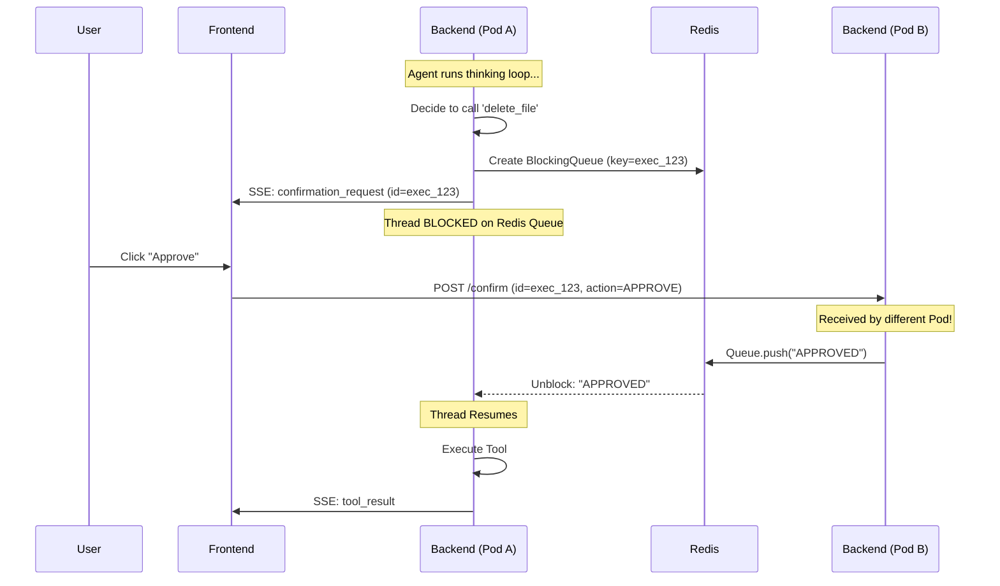
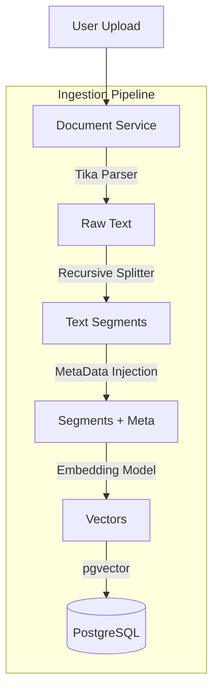

# 从零构建 ZenoAgent 的项目实战

> **摘要**：作为一个长期使用 Java 的后端开发者，我对 AI Agent 的内部运作机制充满了好奇。为了深入理解 Agent 的工作原理，我决定动手写一个简单的 Agent 系统 —— **ZenoAgent**。本文记录了我在这个过程中的学习心得与技术实践，包括如何**手写 ReAct 循环**、**在分布式环境下实现 Human-in-the-loop**、**尝试复刻类 o1 的流式思考**以及**探索错误处理机制**。希望这些踩坑经验能给同样想探索 AI 的 Java 开发者一些参考。

**👀 在线体验**：项目已部署上线，欢迎试玩：[http://1.94.53.50/](http://1.94.53.50/)
*(注：受限于服务器资源，线上部署了 Qwen3:8B 模型，虽不如商业模型聪明，但足以演示 Agent 的核心能力)*


## 💡 写在前面：我的学习初衷

市面上已经有了像 LangChain 和 AutoGen 这样非常优秀的成熟框架，它们功能强大且生态丰富。但作为一名对 AI 技术充满热情的 Java 开发者，我总觉得光是调用 API 或使用现成的 SDK，很难真正触达 Agent 技术的核心。

我发起 ZenoAgent 这个项目的初衷非常简单：**我想通过亲手造一遍轮子，来弄清楚 Agent 到底是怎么跑起来的。**

在这个过程中，我主要关注以下几个学习点：
1.  **原理探索**：不依赖复杂的封装，亲手实现 ReAct 循环，理解 LLM 是如何规划和执行任务的。
2.  **全栈打通**：尝试从后端推理到前端可视化，完整走一遍 AI 应用的开发流程。
3.  **工程实践**：看看在 Java 生态下，如何处理流式响应、并发控制等实际问题。

ZenoAgent 是我学习过程中的一份“大作业”，虽然它还很稚嫩，但这趟探索之旅让我收获颇丰。

---

## 🏗️ 核心架构概览

ZenoAgent 采用经典的 **DDD（领域驱动设计）** 分层架构，确保了代码的高内聚低耦合。



*   **后端**：Java 17, Spring Boot 3, **LangChain4j** (LLM 交互核心), **Redisson** (分布式协调)
*   **数据存储**：PostgreSQL + pgvector (向量数据库), Redis (缓存与消息队列)
*   **前端**：Vue 3, TypeScript, Tailwind CSS, SSE (Server-Sent Events)

---

## 🔥 硬核亮点解析


### 1. 上下文构造与思维链控制 (Context Construction & CoT)

Agent 聪明的关键在于如何构建 Prompt。ZenoAgent 的 `ThinkingEngine` 采用了 **Hybrid Context Assembly（混合上下文组装）** 的策略。

#### 🧩 混合上下文组装原理 (Hybrid Strategy)

我们不再简单地将所有信息拼接到一个巨大的 User Prompt 中，而是充分利用 LLM 的 **Native Messages** 结构，将上下文拆解为三个部分：

1.  **System Message**: 定义角色、工具使用规范和输出格式（JSON Schema）。
2.  **History Messages (Native)**: 直接插入 `List<ChatMessage>`，保留 User/Assistant 的原生角色信息。这让模型能完美理解对话流转，且有利于 KV Cache 加速。
3.  **Current Context (Text)**: 将“当前目标”、“可用工具”、“最近的 Action 执行结果”拼接到**最新的一条 UserMessage** 中。

```java
// ThinkingEngine.java 核心重构
List<ChatMessage> messages = new ArrayList<>();

// 1. System Prompt (规则与约束)
messages.add(new SystemMessage(sysPrompt));

// 2. Native History (利用 KV Cache)
messages.addAll(context.getMessages()); 

// 3. Current Context (动态任务背景)
String currentStepPrompt = """
    ## 当前目标
    %s

    ## 可用工具
    %s

    ## 最近执行结果
    %s
    """.formatted(goal, tools, actionHistory);

messages.add(new UserMessage(currentStepPrompt));
```

这种设计既保留了 Agent 执行过程的灵活性（通过 Text 描述复杂的 Action/Result），又利用了 LLM 原生对话结构的优势（语义清晰、Token 复用）。

#### 🧠 如何控制大模型"先想后做"？

我们通过 Prompt Engineering 强制 LLM 遵循 **Thought-Action-Observation** 范式。

*   **强制输出 `<thinking>` 标签**：在 System Prompt 中明确要求 LLM 先输出 XML 格式的思考过程，再输出 JSON 格式的动作指令。
*   **"三段式"输出协议（踩坑经验）**：

    > **⚠️ 踩坑记录**：最初我只要求模型输出 `<thinking>` 和 `<actions>` 两部分。结果发现，许多模型（尤其是非顶流模型）在输出完 `</thinking>` 后，会习惯性地加一句“好的，根据以上分析，我现在的计划是...”，然后才输出 JSON。这会导致 JSON 解析器直接报错。

    **最终解决方案**：引入一个强制的“截断标记” `<THINKING_DONE>`。

    ```text
    1. <thinking>...</thinking>
    2. <THINKING_DONE>  <-- 强制刹车信号
    3. <actions>{...}</actions>
    ```

    后端检测到 `<THINKING_DONE>` 后，会触发状态流转，并忽略该标记之前的所有非 JSON 文本，确保 `<actions>` 的纯净。

*   **流式解析状态机**：后端维护一个轻量级的状态机，实时解析流式响应。



这种机制不仅让 Agent 的决策更理性（Chain of Thought），还让用户能实时看到 AI 的"心路历程"，体验感拉满。

#### 🛡️ 防御式编程：四重保障解决“大模型不听话”

为了让 LLM 稳定输出符合 Java 强类型要求的 JSON，我采取了一套**四重保障机制**：

1.  **Prompt 强约束 (Prompt Engineering)**

    在 `DECISION_FRAMEWORK_PROMPT` 中，不仅定义 Schema，更要**预判错误**。例如，明确禁止 Markdown 代码块：
    ```java
    private static final String JSON_OUTPUT_FORMAT_PROMPT = """
        ## 输出格式强制约束（必须100%遵守，任何违规都会导致输出无效）
        1. 输出内容必须是**纯合法JSON对象**，无任何非JSON文本（如<thinking>标签、注释、说明文字等）；
        2. JSON对象包含2个必填顶级字段：
           - thinking：字符串类型，填写你的逻辑推演过程（需清晰说明“为什么选择该动作类型”“参数如何确定”等）；
           - actions：数组类型，仅包含1个动作指令对象（单轮仅输出1个动作）；
        3. actions数组中的每个动作对象必须包含以下基础字段：
           - actionType：字符串类型，仅允许取值【TOOL_CALL/RAG_RETRIEVE/LLM_GENERATE/DIRECT_RESPONSE】，严禁使用其他值；
           - actionName：字符串类型，填写动作名称（如search_weather/retrieve_knowledge/generate_content/reply_user）；
           - reasoning：字符串类型，填写选择该动作的简短理由（区别于thinking的详细推演）；
        4. 不同actionType需额外包含对应必填参数字段（缺失会判定为无效）：
        .....
    """;
    ```

2.  **原生 Response Format (Native API)**
    
    对于支持 JSON Mode 的模型，在调用时直接注入约束：
    ```java
    // 强制模型以 JSON Object 模式输出
    ResponseFormat.builder().type(ResponseFormatType.JSON).build();
    ```

3.  **鲁棒性解析 (Robust Parsing)**
    
    后端解析器不能有“洁癖”。我的 `cleanJsonResponse` 方法会自动清洗常见的 LLM 格式错误：
    *   剔除 ` ```json ` 和 ` ``` ` 包裹。
    *   **自动补全截断的 JSON**：利用堆栈检测括号平衡，自动补齐末尾缺失的 `}`。
    ```java
    // PromptGuidedThinkingEngine.java
    if (depth > 0 && start >= 0) {
        log.warn("检测到 JSON 截断，尝试自动补全...");
        // 自动补齐剩余的 '}'
    }
    ```

4.  **自愈式重试循环 (Self-Correction Loop)**

    这是最关键的一道防线。当解析失败时，不要直接抛出异常，而是将**错误堆栈作为 Prompt** 反馈给模型。
    ```java
    try {
        finalActions = parseThinkingResult(fullText);
    } catch (LLMParseException e) {
        // 将错误信息回传给模型，进行"反思修正"
        retryHint = "上次输出解析失败：" + e.getMessage() + "，请严格修正格式。";
        // 进入下一轮循环 retry...
    }
    ```
    实测表明，这种机制能将复杂任务的执行成功率从 60% 提升至 95% 以上。

---

### 2. ReAct 模式设计与工程实现

ZenoAgent 的核心并未采用现成的 Agent 框架，而是手写了一个基于状态机的 ReAct 循环引擎。在设计过程中，我重点思考了**Action 的原子化**与**交互的低延迟**。

#### �️ 2.1 Action 的原子化抽象

为了让 LLM 的输出更可控，我将 Agent 的所有能力抽象为 4 种原子 Action：

*   **TOOL_CALL**：调用外部工具（通过 MCP 协议）。
*   **RAG_RETRIEVE**：检索知识库（弥补模型长短期记忆）。
*   **LLM_GENERATE**：让子模型处理纯文本生成任务（如润色、翻译）。
*   **DIRECT_RESPONSE**：直接向用户输出结果。

这种设计让 ReAct 循环的边界非常清晰：`Thinking` -> `Action List` -> `Execution` -> `Observation`。

#### ⚡ 2.2 为什么设计 DIRECT_RESPONSE？（性能优化的关键）

在早期的 ReAct 实践中，我发现一个严重的性能浪费：
**对于简单的闲聊（如“你好”）或知识性问答，标准 ReAct 模式太重了。**

*   **传统模式**：用户问“你好” -> LLM 思考 -> 决定不调用工具 -> 输出 Final Answer。这通常需要消耗完整的推理步骤，甚至有的框架会强制要求先调用一个 `talk` 工具，增加了一次毫无意义的 RTT（网络往返）。
*   **ZenoAgent 模式**：我将“回复用户”设计为一种 Action (`DIRECT_RESPONSE`)。

**优化收益**：
当模型判断无需使用工具时，它可以直接在决策阶段生成 `DIRECT_RESPONSE` 动作。**这意味着“思考”和“回复”在一次 LLM 调用中同时完成了**，对于简单场景，延迟降低了 50% 以上，且大幅节省了 Token。

#### 🚀 2.3 并发执行机制 (Parallel Execution)

传统的 ReAct 模式是严格串行的（Think -> Act -> Observe -> Think），这会导致严重的性能瓶颈。

ZenoAgent 对此进行了改良：允许 LLM 在一次 Thinking 过程中输出**多个 Action**。
例如，当用户问“对比北京和上海的天气”时，Agent 会同时生成两个查询动作，后端利用 Java 的 `CompletableFuture` 并行分发请求。

```java
// ActionExecutor.java 核心逻辑
public List<ActionResult> executeParallel(List<AgentAction> actions) {
    List<CompletableFuture<ActionResult>> futures = actions.stream()
        .map(action -> CompletableFuture.supplyAsync(() -> execute(action), executor))
        .toList();
    
    // 并行等待所有结果
    return futures.stream().map(CompletableFuture::join).toList();
}
```
这种设计将多步串行任务的耗时压缩到了最慢的那一个 Action 的耗时，响应速度提升显著。

#### 🕳️ 2.4 实战踩坑：isComplete 的语义陷阱

在实现 `DIRECT_RESPONSE` 时，我引入了一个 `isComplete` 字段来控制循环是否结束。看似简单，却踩了一个大坑。

**问题复现**：
当用户说“查天气”，Agent 需要反问“请问是哪个城市？”。
此时，Agent 认为任务**并未完成**，于是将 `isComplete` 设为 `false`。
结果：后端 ReAct 引擎收到 `false` 后，认为 Agent 还要继续干活，于是**不等待用户回复**，直接进入下一轮循环。Agent 发现没拿到城市名，又问一遍，导致死循环。

**深度反思**：
大模型对 `Complete`（完成）的理解是“任务终结”。但在交互式场景中，我们需要的是“控制权移交”。

**解决方案**：
我重构了 Prompt 中对 `isComplete` 的语义定义，从“任务状态”转变为“流控制状态”：

*   **`isComplete=true`**：**移交控制权**。
    *   场景 1：任务彻底完成。
    *   场景 2：**需要提问并等待用户回复**（虽然任务没完，但我得停下来等你）。
*   **`isComplete=false`**：**保持控制权**。
    *   场景：发送“正在查询”、“已调用工具”等过程通知，**不等待用户回复**，流程自动继续。

**修正后的 Prompt 片段**：
```java
// PromptGuidedThinkingEngine.java
3. 需要向用户输出内容时使用 DIRECT_RESPONSE，并通过 isComplete 字段控制流程：
   - isComplete=true：**终止本轮**。用于：1. 任务彻底完成；2. **需要提问并等待用户回复**。此时意味着 Agent 暂停工作移交控制权给用户；
   - isComplete=false：**过程通知**。用于：任务仍在进行中，仅向用户发送进度提示，**不等待用户回复**，流程自动继续。
```

通过这种语义重构，配合 Few-Shot 示例（明确展示“反问用户”时设为 true），Agent 终于学会了在适当的时候“闭嘴等待”。

---

### 3. 分布式环境下的 "Human-in-the-loop"

在企业级应用中，敏感操作（如删除文件、转账）必须经过**人工确认**。但在 **K8s 多副本部署**场景下，这面临一个巨大挑战：
> **问题**：Agent 的推理线程（持有 SSE 连接）可能在 Pod A 上运行，而用户点击“确认”的 HTTP 请求可能打到了 Pod B。如何让 Pod A 知道用户在 Pod B 做了确认？

**解决方案：基于 Redis 阻塞队列的分布式信号量**

ZenoAgent 利用 `Redisson` 实现了跨实例的线程挂起与唤醒。

#### 📡 分布式确认时序图



**代码实现参考：**
```java
// ToolConfirmationManager.java
public ToolExecutionDecision waitForDecision(String executionId) {
    RBlockingQueue<ToolExecutionDecision> queue = redissonClient.getBlockingQueue(KEY_PREFIX + executionId);
    // 阻塞等待用户决策，支持超时自动拒绝
    return queue.poll(60, TimeUnit.SECONDS);
}
```

---

### 4. 流式思考：从 Prompt 模拟到原生 API 适配

为了让用户感知到 AI 的“思考过程”，ZenoAgent 实现了基于 Prompt 注入和原生支持的思考引擎，支持根据配置自动注入，分别适配普通模型和推理模型。

####  方案一：Prompt 引导的模拟思考 (通用方案)

对于普通模型（如 GPT-4, Qwen-2.5），我们通过 System Prompt 强制要求模型在输出最终 JSON 动作前，先在 `thinking` 字段中输出思维链。

**核心原理**：
将“思考”作为 JSON 结构的一部分。虽然这违反了“纯数据”的原则，但能确保模型在生成 Action 之前必须先进行逻辑推演（CoT）。

**实现挑战**：
在流式响应中，JSON 是逐字生成的。我们需要在后端实时解析这个不完整的 JSON 字符串，提取出 `thinking` 字段的增量内容推送到前端。

**代码参考**：
[PromptGuidedThinkingEngine.java](../backend/src/main/java/com/aiagent/application/service/engine/PromptGuidedThinkingEngine.java) 使用了状态机来解析流式 JSON：

```java
// 伪代码：从流式 JSON 中提取 thinking 字段
if (token.contains("\"thinking\"")) {
    isThinking = true;
}
if (isThinking && !token.contains("\"actions\"")) {
    sseEmitter.send(token); // 实时推送思考过程
}
```

#### 方案二：原生 Reasoning 字段适配 (未来趋势)

随着 DeepSeek-R1 和 OpenAI o1 的发布，模型开始原生支持“推理”。这种模式下，思考过程不再占用 `content` 字段，而是通过独立的 `reasoning` 通道传输。

**核心原理**：
模型在输出 Response 之前，会先在一个独立的 Channel 中输出思维链（CoT）。这个过程对 Prompt 是透明的，属于模型原本的能力。客户端需要监听特定的 API 字段（如 `reasoning_content`）来获取这部分数据。

**代码参考**：
[OpenAIReasoningThinkingEngine.java](../backend/src/main/java/com/aiagent/application/service/engine/OpenAIReasoningThinkingEngine.java) 实现了对原生推理字段的监听。

**实战遇到的协议不匹配问题**：
除了模拟思考，我也尝试接入模型**原生**的思考能力（如 DeepSeek-R1），但在对接 **Ollama** 时遇到了协议标准不统一的深坑。

**问题复现**：
我在 [OpenAIReasoningThinkingEngine.java](../backend/src/main/java/com/aiagent/application/service/engine/OpenAIReasoningThinkingEngine.java) 中尝试解析流式响应，发现虽然模型在“思考”，但后端却拿不到内容。

**排查过程**：
1.  **抓包分析**：Ollama 的 API 返回字段是 `reasoning`。
    ```json
    {
        "choices": [
            {
                "delta": {
                    "role": "assistant",
                    "reasoning": "好的，用户想要..." // Ollama 使用 reasoning
                }
            }
        ]
    }
    ```
2.  **源码比对**：LangChain4j 框架底层期望的字段却是 `reasoning_content`。
    ```java
    // LangChain4j Delta.java
    @JsonProperty
    private final String reasoningContent; // 字段名不匹配！
    ```
3.  **社区现状**：查阅 [Ollama Issue #13372](https://github.com/ollama/ollama/issues/13372) 发现，由于 OpenAI 官方 Spec 尚未标准化该字段，各家实现出现了分歧。

**后果与反思**：
这意味着，如果我们直接用 LangChain4j 调用 Ollama 部署的 R1 模型，**模型在耗费算力进行“昂贵”的思考（首 Token 延迟高），但客户端却直接丢弃了这部分数据**。这不仅是体验缺失，更是算力的无端浪费。目前的解决方案只能是通过自定义 `StreamingResponseHandler` 手动适配字段。

#### 🚧 实战踩坑：流式标签泄露与 Lookahead Buffer

在实现方案一（Prompt 模拟）时，我遇到了一个非常棘手的问题：前端偶尔会闪现出 `</thinking` 这样残缺的标签。

**问题根源**：LLM 的 Token 是逐字吐出的。当模型输出 `</thinking>` 时，可能先吐出 `</`，此时后端检测不到完整标签，误以为是普通文本就直接发给了前端；紧接着模型吐出 `thinking>`，后端这才反应过来是标签，拦截了后半段，但前半段 `</` 已经泄露了。

**解决方案**：引入 **Lookahead Buffer（前缀缓冲）** 机制。

我们在后端增加了一个判断逻辑：**在流未结束时，如果缓冲区末尾匹配 `</thinking>` 的任意前缀（如 `<`、`</`、`</t`），先扣留这部分内容不发**。只有当下一个 Token 进来，证明它拼不成完整标签时，才把缓冲区的内容释放出去。

```java
// ThinkingEngine.java
if (thinkingEndIdx == -1 && !isComplete) {
    // 检查末尾是否是 </thinking> 的一部分
    int bufferLen = calculatePartialTagMatchLength(currentContent);
    if (bufferLen > 0) {
        // 扣留这部分内容，暂不发送
        logicalEnd -= bufferLen;
    }
}
```

####  进阶优化：事件驱动的国际化 (i18n)

为了解决这个问题，我重构了事件系统，不再发送自然语言，而是发送**结构化状态事件**（如 `agent:status:thinking_process`）。前端接收到事件 ID 后，再根据当前用户的语言设置（zh-CN/en-US）渲染对应的文案。这不仅解耦了前后端，也让国际化变得异常简单。

---

### 5. RAG 知识库：从摄入到召回的全链路优化

ZenoAgent 的 RAG 模块（`RAGEnhancer`）不仅仅是简单的向量相似度搜索，而是构建了一套完整的知识流转体系。

#### 📂 文档摄入流程 (Document Ingestion)

我们使用 **Apache Tika** 进行全格式解析，并配合 **Recursive Character Splitter** 进行语义分块。



#### 🔍 动态召回策略 (Dynamic Retrieval)

*   **元数据隔离**：基于 `knowledgeId` 进行物理/逻辑隔离，确保多用户数据安全。
*   **动态表名路由**：根据 Embedding 模型的维度（如 768 vs 1536），动态路由到不同的向量表，支持多模型共存。
*   **结构化上下文注入**：

```java
// RAGEnhancer.java 核心逻辑
embeddingStore.search(EmbeddingSearchRequest.builder()
    .queryEmbedding(queryVector)
    .filter(metadataKey("knowledgeId").isEqualTo(currentKnowledgeId)) // 关键：租户隔离
    .maxResults(5)
    .minScore(0.75) // 过滤低质量结果
    .build());
```

---

### 7. 自愈式错误处理 (Self-Correction)

ZenoAgent 不仅能执行工具，还能**从错误中学习**。当工具调用失败（如参数错误、网络超时）时，Agent 不会直接崩溃，而是进入**自愈循环**。

*   **错误捕获**：`ActionExecutor` 捕获异常，生成包含错误信息的 `ActionResult`。
*   **上下文反馈**：错误信息被记录到 `AgentContext` 中。
*   **Prompt 注入**：在下一轮 `Thinking` 阶段，Prompt 会包含："*上一步操作失败，错误信息：Invalid argument...*"。
*   **智能修正**：LLM 看到错误后，会尝试修正参数或选择替代工具，重新发起调用。

> 这种机制让 ZenoAgent 具备了极强的鲁棒性，能够自动应对 API 变更或临时性网络故障。

---

### 8. 动态工具发现与热加载

基于 **MCP (Model Context Protocol)**，ZenoAgent 实现了工具的动态管理。

*   **热加载 (Hot Reload)**：`McpConfigLoader` 监听配置文件变更。一旦修改 `mcp.json`，系统会自动重新连接 MCP Server 并刷新工具列表，无需重启服务。
*   **分组管理**：支持对工具进行分组（Group），通过配置即可灵活启用/禁用特定业务线的工具集。

---

## 📸 系统预览

为了让大家更直观地感受 ZenoAgent，这里放几张系统截图：

| 欢迎页 | 智能对话 |
| :---: | :---: |
|  |  |

| Agent 配置 | 知识库管理 |
| :---: | :---: |
|  |  |

## 🚀 总结与展望

ZenoAgent 是我边学习边实践的产物。通过 Spring Boot 的工程化能力，我们可以构建出比 Python 原型更稳定、更易于扩展的 Agent 系统。

目前项目已开源，欢迎感兴趣的朋友 Star ⭐️ 和 PR！

*   **GitHub**: [https://github.com/zeno-agent/zeno-agent](https://github.com/zeno-agent/zeno-agent)
*   **主要特性**: ReAct 引擎、RAG 知识库、MCP 工具协议、分布式协同、流式思考。

让我们一起探索 AI Agent的无限可能！
